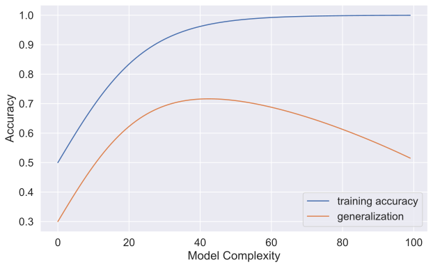
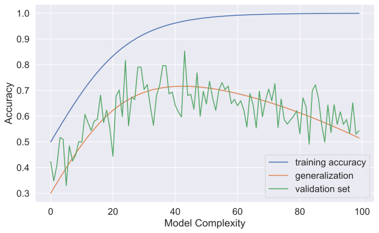
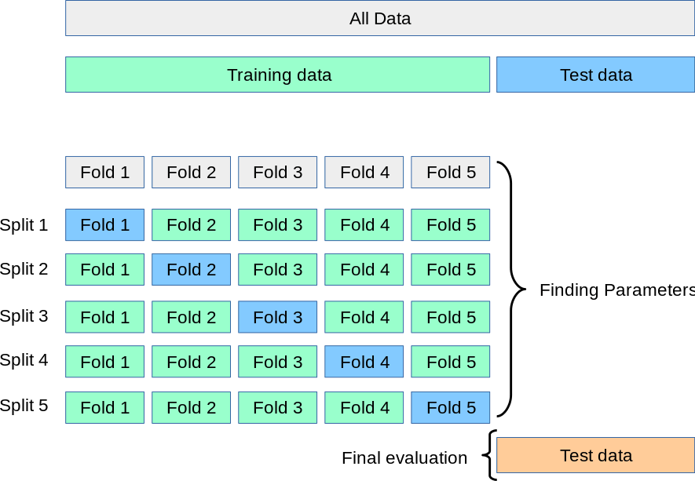
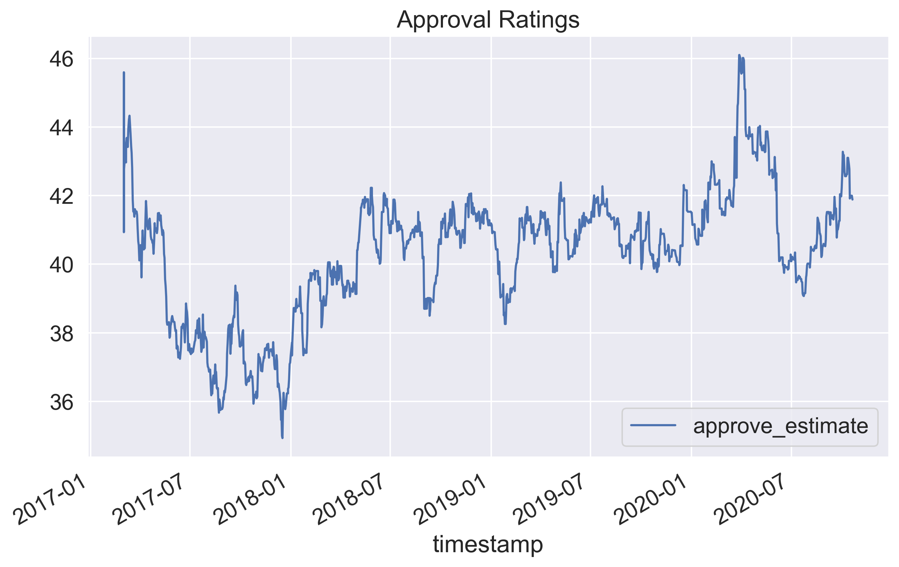
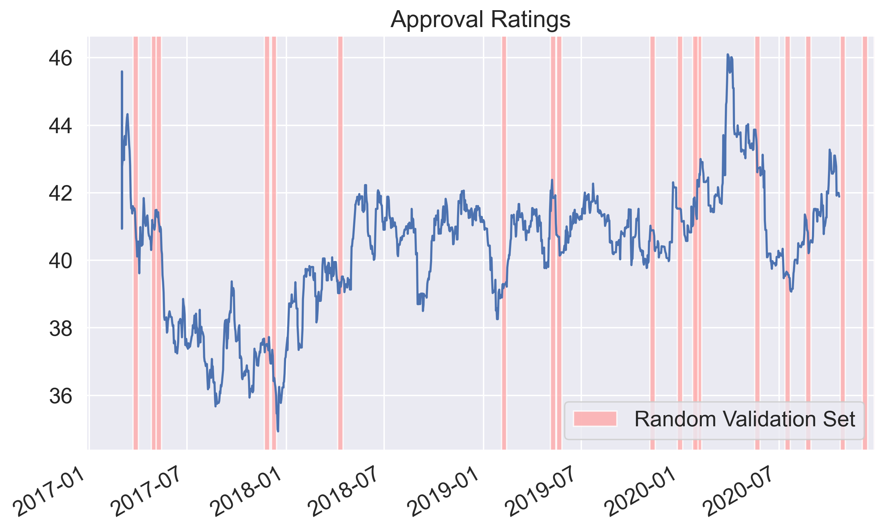
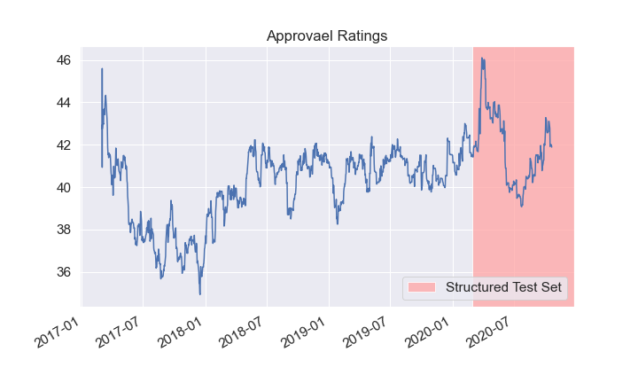
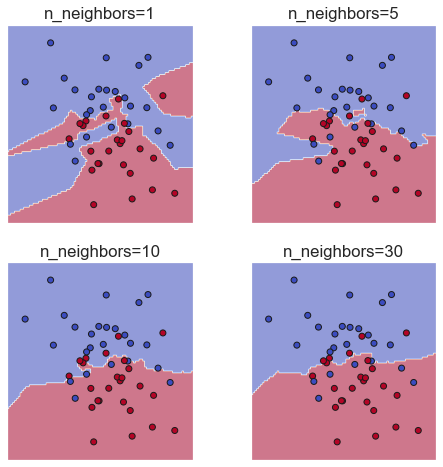
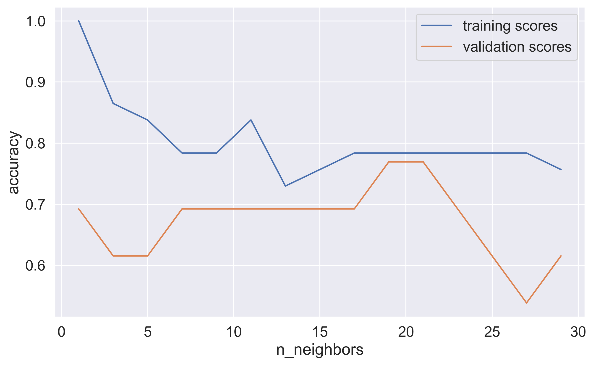

title: Intermediate Machine Learning with scikit-learn: Cross validation, Parameter Tuning, Pandas Interoperability, and Missing Values
use_katex: True
class: title-slide

# Intermediate Machine Learning with scikit-learn
## Cross validation, Parameter Tuning, Pandas Interoperability, and Missing Values


.larger[Thomas J. Fan]<br>
@thomasjpfan<br>
<a href="https://www.github.com/thomasjpfan" target="_blank"><span class="icon icon-github icon-left"></span></a>
<a href="https://www.twitter.com/thomasjpfan" target="_blank"><span class="icon icon-twitter"></span></a>
<a class="this-talk-link", href="https://github.com/thomasjpfan/ml-workshop-intermediate-1-of-2" target="_blank">
This workshop on Github: github.com/thomasjpfan/ml-workshop-intermediate-1-of-2</a>

---

name: table-of-contents
class: title-slide, left

# Table of Contents
.g[
.g-6[
1. [Cross Validation](#validation)
1. [Parameter Tuning](#parameter-tuning)
1. [Missing Values](#missing-values)
1. [Pandas Interoperability](#pandas)
]
.g-6.g-center[

]
]

---

# Scikit-learn API

.center[
## `estimator.fit(X, [y])`
]

.g[
.g-6[
## `estimator.predict`
- Classification
- Regression
- Clustering
]
.g-6[
## `estimator.transform`
- Preprocessing
- Dimensionality reduction
- Feature selection
- Feature extraction
]
]

---

# Data Representation


---

# Supervised ML Workflow


---

class: chapter-slide

# Notebook 📒!
## notebooks/00-review-sklearn.ipynb

---

name: validation
class: chapter-slide

# 1. Cross Validation

.footnote-back[
[Back to Table of Contents](#table-of-contents)
]

---

# Single train test split


---

# Three Fold Split


---

# Why cross validate?



---

# Why cross validate?



---

# Can we do better?



---

class: chapter-slide

# Notebook 📓!
## notebooks/01-cross-validation.ipynb

---

class: chapter-slide

# Cross Validation Strategies

---


---


---


---


---

# Strategies for increasing the number of folds

- High variance, takes a long time
```py
from sklearn.model_selection import LeaveOneOut
```

- `ShuffleSplit` with stratification
```py
from sklearn.model_selection import StratifiedShuffleSplit
```

- Repeat `KFold` or `StratifiedKFold`
```py
from sklearn.model_selection import RepeatedKFold
from sklearn.model_selection import RepeatedStratifiedKFold
```

---

# Cross-validation with non-idd data

## Grouped data

- Assume data is not iid such as patient ID or user id
- We want to generalized to a new patient

## Time Series

- Data is correlated

---


---



---



---



---


---


---

class: chapter-slide

# Notebook 📓!
## notebooks/01-cross-validation.ipynb

---

name: parameter-tuning
class: chapter-slide

# 2. Parameter Tuning

.footnote-back[
[Back to Table of Contents](#table-of-contents)
]

---

class: center

# What Tune Parameters?



---

# Score vs n_neighbors



---

# Parameter Tuning Workflow


---

# GridSearchCV

```py
from sklearn.model_selection import GridSearchCV

param_grid = {'n_neighbors': np.arange(1, 30, 2)}
grid = GridSearchCV(KNeighborsClassifier(), param_grid=param_grid,
                    return_train_score=True)

grid.fit(X_train, y_train)
```

Best score

```py
grid.best_score_
```

Best parameters

```py
grid.best_params_
```

---

# Random Search


---

# RandomizedSearchCV with scikit-learn

```py
from scipy.stats import randint
param_dist = {
    "max_depth": [3, None],
    "max_features": randin(1, 11)
}

random_search = RandomizedSearchCV(
    clf,
    param_distributions=param_dist,
    n_iter=200
)
```

- Values in `param_distributions` can be a list or an object from the
`scipy.stats` module

---

class: chapter-slide

# Notebook 📓!
## notebooks/02-parameter-tuning.ipynb

---

name: missing-values
class: chapter-slide

# 3. Missing Values

.footnote-back[
[Back to Table of Contents](#table-of-contents)
]

---

# Imputers in scikit-learn

## Impute module

```py
from sklearn.impute import SimpleImputer
from sklearn.impute import KNNImputer

# `add_indicator=True` to add missing indicator
imputer = SimpleImputer(add_indicator=True)

from sklearn.experimental import enable_iterative_imputer
from sklearn.impute import IterativeImputer
```

---

# Comparing the Different methods


---

# Estimators with native support

## Histogram-based Gradient Boosting Regression Trees

- Based on LightGBM implementation
- Have native support for missing values

```py
from sklearn.experimental import enable_hist_gradient_boosting
from sklearn.ensemble import HistGradientBoostingClassifier
from sklearn.ensemble import HistGradientBoostingRegressor
```

---

class: chapter-slide

# Notebook 📔!
## notebooks/03-missing-values.ipynb

---

name: pandas
class: chapter-slide

# 4. Pandas Interoperability

.footnote-back[
[Back to Table of Contents](#table-of-contents)
]

---

# Categorical Data

## Examples of categories:

- `['Manhattan', 'Queens', 'Brooklyn', 'Bronx']`
- `['dog', 'cat', 'mouse']`

## Scikit-learn Encoders

```py
from sklearn.preprocessing import OrdinalEncoder
```
- Encodes categories into an integer

```py
from sklearn.preprocessing import OneHotEncoder
```
- Binary column for each category

---

# Heterogenous data

## Example: Titanic Dataset

<table border="1" class="dataframe">
  <thead>
    <tr style="text-align: right;">
      <th></th>
      <th>pclass</th>
      <th>sex</th>
      <th>age</th>
      <th>sibsp</th>
      <th>parch</th>
      <th>fare</th>
      <th>embarked</th>
      <th>body</th>
    </tr>
  </thead>
  <tbody>
    <tr>
      <th>0</th>
      <td>1.0</td>
      <td>female</td>
      <td>29.0000</td>
      <td>0.0</td>
      <td>0.0</td>
      <td>211.3375</td>
      <td>S</td>
      <td>NaN</td>
    </tr>
    <tr>
      <th>1</th>
      <td>1.0</td>
      <td>male</td>
      <td>0.9167</td>
      <td>1.0</td>
      <td>2.0</td>
      <td>151.5500</td>
      <td>S</td>
      <td>NaN</td>
    </tr>
    <tr>
      <th>2</th>
      <td>1.0</td>
      <td>female</td>
      <td>2.0000</td>
      <td>1.0</td>
      <td>2.0</td>
      <td>151.5500</td>
      <td>S</td>
      <td>NaN</td>
    </tr>
    <tr>
      <th>3</th>
      <td>1.0</td>
      <td>male</td>
      <td>30.0000</td>
      <td>1.0</td>
      <td>2.0</td>
      <td>151.5500</td>
      <td>S</td>
      <td>135.0</td>
    </tr>
    <tr>
      <th>4</th>
      <td>1.0</td>
      <td>female</td>
      <td>25.0000</td>
      <td>1.0</td>
      <td>2.0</td>
      <td>151.5500</td>
      <td>S</td>
      <td>NaN</td>
    </tr>
  </tbody>
</table>

---

# scikit-learn's ColumnTransformer


---

class: chapter-slide

# Notebook 📔!
## notebooks/04-pandas-interoperability.ipynb

---

class: title-slide, left

# Closing

.g.g-middle[
.g-7[

1. [Cross Validation](#validation)
1. [Parameter Tuning](#parameter-tuning)
1. [Missing Values](#missing-values)
1. [Pandas Interoperability](#pandas)
]
.g-5.center[
<br>
.larger[Thomas J. Fan]<br>
@thomasjpfan<br>
<a href="https://www.github.com/thomasjpfan" target="_blank"><span class="icon icon-github icon-left"></span></a>
<a href="https://www.twitter.com/thomasjpfan" target="_blank"><span class="icon icon-twitter"></span></a>
<a class="this-talk-link", href="https://github.com/thomasjpfan/ml-workshop-intermediate-1-of-2" target="_blank">
This workshop on Github: github.com/thomasjpfan/ml-workshop-intermediate-1-of-2</a>
]
]
